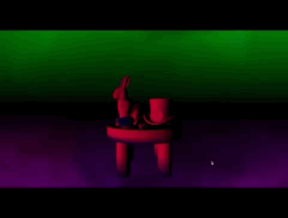

# Objects In Wonderland 3D WEBGL
</img>

**📅 제작 기간**: 2020년 상반기 (기획 포함 약 일주일)  

## 🔗 프로젝트 개요  
‘이상한 나라의 앨리스’를 컨셉으로, 학과 건물 출입 시 3D 프로젝트를 상영하는 아이디어에서 출발했다.  
출입문이 열릴 때마다 화면 속 테이블 위의 물건들이 멀리 날아갔다가 다시 돌아오는 방식으로, 문을 여는 소리가 클수록 물건들이 더 멀리 날아가는 인터랙티브한 웹 프로젝트이다.  

## 🎬 결과물  
- **Live 링크**: [Objects In Wonderland](https://donginlee.github.io/Objects-In-Wonderland/)  
- **작동 영상**: 상단

## 💡 작동 방식  
1. 사용자가 **마이크 접근을 허용**하면, 프로그램이 주변 소리를 감지함.  
2. **마우스를 한 번 클릭한 후**, 소리(박수, 휘파람 등)를 내면 테이블 위의 물건들이 멀리 날아감.  
3. **소리가 클수록** 물건들이 더 멀리 날아갔다가 다시 원래 자리로 돌아옴.  

## 📸 시각 자료  
| 테이블 위의 물건들 | 큰 소리로 날아가는 모습 | 원래 자리로 돌아오는 모습 |  
|-------------|------------------------|--------------------|  
|  |  |  |  

## 🔧 기술 스택  
- HTML, CSS, WEBGL
- **p5.js** (인터랙티브 웹 개발을 위한 JavaScript 라이브러리)  

## 🎭 역할 분담  
### 🔹 본인 
- 테이블 위의 **물건 배치** 구현  
- **마이크 입력 볼륨에 비례하여** 물건들이 멀리 날아갔다가 돌아오는 함수 개발  

### 🔹 다른 팀원
- **배경 Shader 함수** 구현  
- 물건에 **Shader 질감 적용**  

## 📝 느낀 점 및 아쉬운 점  

### 🔹 프로그램 측면  
- 평균적으로 **소음이 많은 환경**에서는 물건들이 계속해서 날아가는 문제가 있었다.  
  → 주변 소음의 **평균 크기**를 구해두고, **평균보다 큰 소리**가 입력될 때만 물건들이 반응하도록 조정했으면 더 자연스러웠을 것 같다.  

### 🔹 개인적인 아쉬움  
- **객체별로 중복 코드가 많아** `class`를 사용했으면 코드가 더 깔끔했을 것 같다.  
- **클린 코드와 객체지향 설계에 대해 배우기 전**에 만든 프로젝트기 때문에 코드가 매우 깔끔하지 않다. 
- 하지만, 기획 의도에 맞춰 복잡한 함수를 직접 구현하는 과정이 흥미로웠다.  

## 📂 코드 저장소  
[GitHub Repository](https://github.com/donginLee/Objects-In-Wonderland)  
